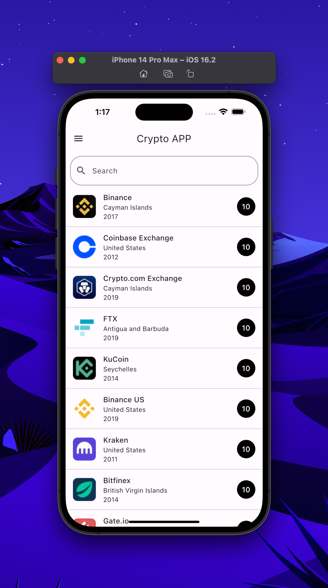
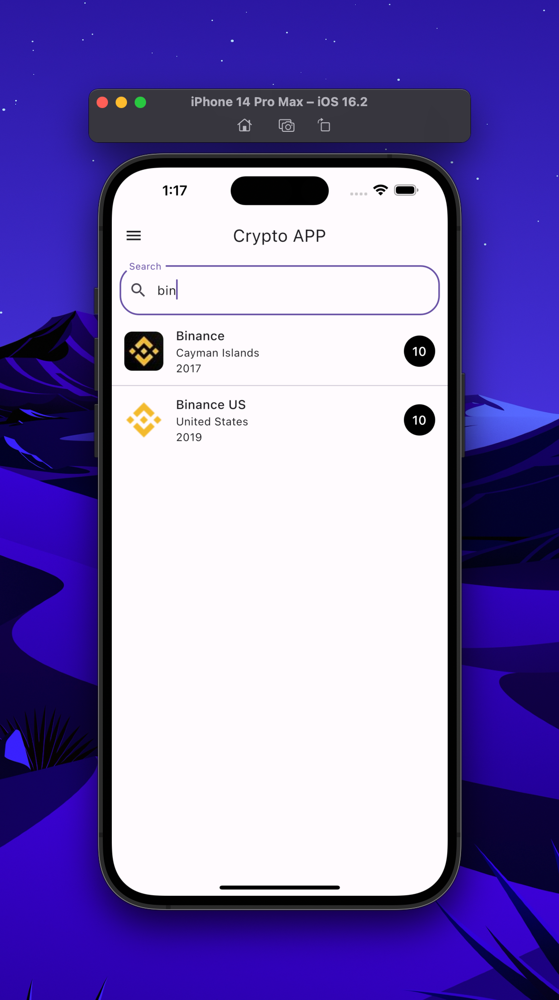
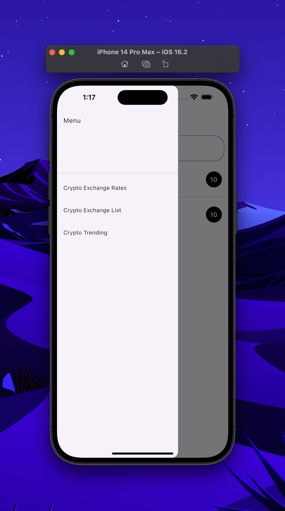
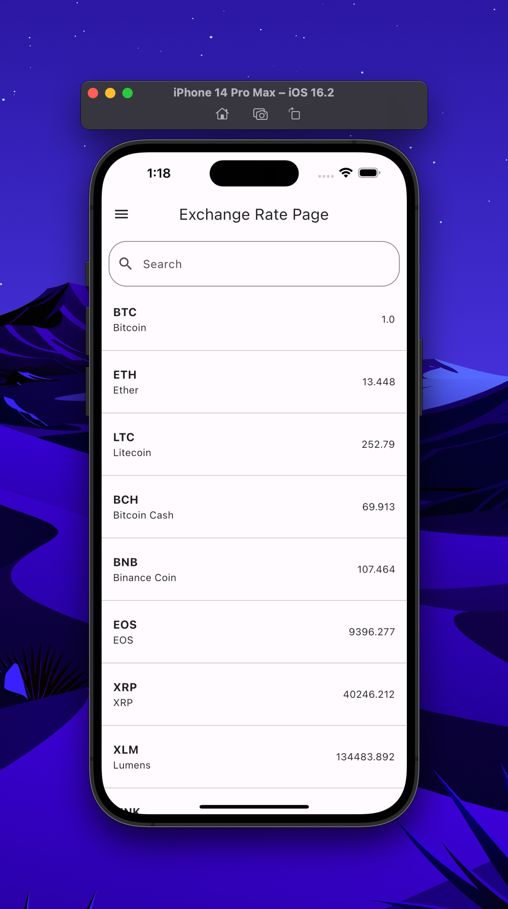
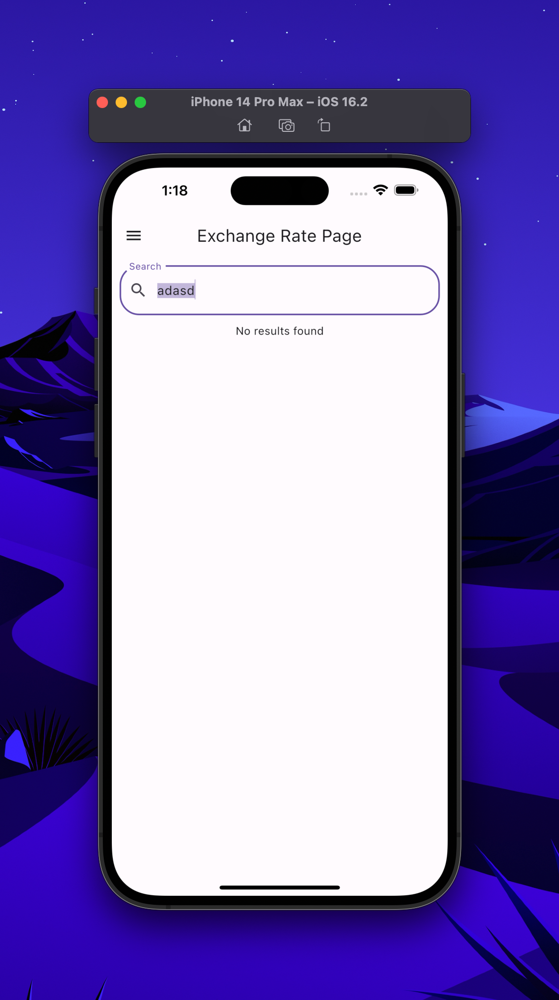
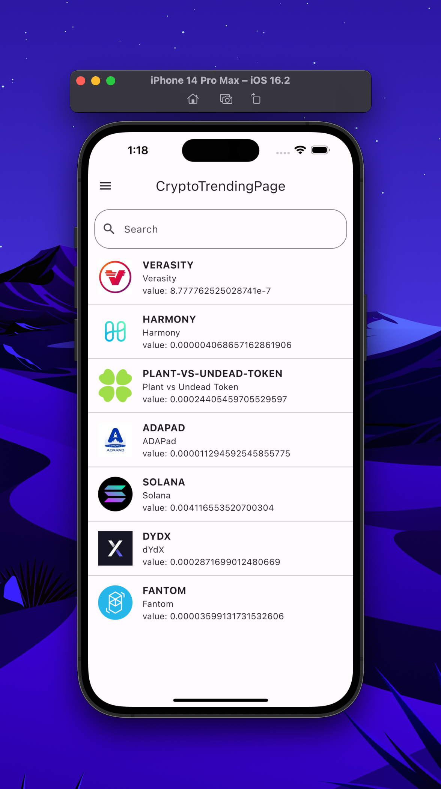

# App de crypto currencies
## Links:
### Repo: https://github.com/JulioGiovanni/Flutter-Apps/tree/main/list_views_cripto
### Video: https://drive.google.com/drive/folders/1wTRAoTfreB-dE70q0QP6Q7yjNRGZ-Wc3

## Temas vistos:

### Listado de Widgets utilizados

- SingleChildScrollView
- Column
- ListView.Separator
- Text
- Icon
- Image.network
- Padding
- Avatar
- Drawer

En esta app se vieron temas acerca de como utilizar un archivo como fuente de datos.
Primero se convirtió en un JSON para poder acceder los índices, pero para el filtrado era necesario manejarlo como lista.
Al convertirse en lista se tenía que utilizar un método entries (En caso de ser necesario) para después convertirlo a lista con un ´´´.ToList()´´´

Una vez convertida la información, se puede acceder a ella con un Widget ListView Builder (En mi caso use Separator para que tuviera un divider entre elementos).

## Lo que más trabajo me costó

Esta es la primera app que si tuve que investigar varias cosas por mi cuenta, por ejemplo como utilizar un TextField para filtrar datos en tiempo real.
Estos fueron los enlaces que me ayudaron:

- https://www.kindacode.com/article/how-to-create-a-filter-search-listview-in-flutter/
- https://stackoverflow.com/questions/68088297/cant-update-list-with-setstate-in-flutter
- https://stackoverflow.com/questions/63760152/how-to-capitalize-text-in-flutter
- https://stackoverflow.com/questions/50794021/flutter-listview-builder-in-scrollable-column-with-other-widgets
- https://api.flutter.dev/flutter/dart-core/MapEntry-class.html

Lo más difícil fue el filtrado en tiempo real porque es necesario manejarlo como una lista, entonces primero tenía que convertirlo y después filtrarlo, no encontraba la manera cómo hacerlo, así que Github Copilot me ayudó, pero también ** Stack Overflow **

También se me complicó utilizar un Listview Builder dentro de una columna, así que tuve que investigar y encontré el Widget ** SingleChildScrollView ** y modificar las físicas del Listview y hacer que tomara menos espacio con el método shrink.

## Lo que aprendí

Con esta tarea siento que aprendí muchísimo más que con otras, ya que tuve que investigar desde un principio como utilizar un Drawer y poner ahí un Navigator para navegar entre pantallas.
Además de todo lo complicado que fue agregar el ListView con la columna y el filtrado de datos. Me frustré bastante con el filtrado de datos pero quedé bastante satisfechó con el resultado. A pesar de todo, disfruté mucho esta tarea.

## Screenshots de la app

